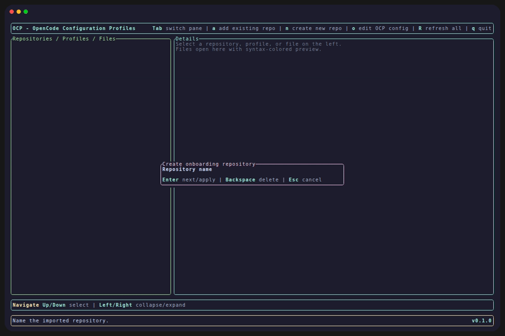

<p align="center">
  
</p>

<h1 align="center">Switch OpenCode configurations like code, not chaos.</h1>

<p align="center">
  <strong>ocp</strong> is a developer-first CLI for managing OpenCode profiles in Git,
  so work, personal, OSS, and experimental environments stay clean, reproducible, and one command away.
</p>

<p align="center">
  <a href="https://github.com/alvarosanchez/ocp/stargazers"></a>
  <a href="https://github.com/alvarosanchez/ocp/releases"></a>
  <a href="https://github.com/alvarosanchez/ocp/releases"></a>
  <a href="LICENSE"></a>
  
  
  
</p>

<p align="center">
  <a href="#get-started"><strong>Get started</strong></a>
  ·
  <a href="https://alvarosanchez.github.io/ocp/docs/"><strong>Read the docs</strong></a>
  ·
  <a href="https://github.com/alvarosanchez/ocp/stargazers"><strong>Star on GitHub</strong></a>
  ·
  <a href="#contributing"><strong>Contribute</strong></a>
</p>

<p align="center">
  If <strong>ocp</strong> is useful to you, please consider <a href="https://github.com/alvarosanchez/ocp/stargazers">starring the repository</a>. It helps more developers discover the project.
</p>

<p align="center">
  
</p>

---

## Why developers use `ocp`

OpenCode configuration tends to drift into local state: copied files, one-off edits, and fragile “don’t touch this” setups that nobody wants to revisit.

`ocp` turns that into a versioned workflow. Profiles live in repositories, changes are reviewable, switching contexts is fast, and your active setup becomes explicit instead of accidental.

<table>
  <tr>
    <td valign="top" width="33%">
      <strong>⚡ Fast context switching</strong><br />
      Move between work, personal, OSS, and experiment setups without manually rewriting config files.
    </td>
    <td valign="top" width="33%">
      <strong>🧬 Configuration in Git</strong><br />
      Treat OpenCode profiles like code: version them, review them, share them, and keep them reproducible.
    </td>
    <td valign="top" width="33%">
      <strong>🛡️ Safer local changes</strong><br />
      `ocp` links active profile files into your OpenCode directory, creates backups when replacing existing files, and rolls back partial switches on failure.
    </td>
  </tr>
</table>

## What `ocp` feels like

```bash
# Add a profile repository
ocp repository add git@github.com:my-org/opencode-profiles.git --name my-org-opencode-profiles

# See what is available
ocp repository list
ocp profile list

# Switch your active OpenCode configuration
ocp profile use my-company
```

That is the core idea: store configuration intentionally, discover it easily, and switch without friction.

## What you get

- **Repository-backed profiles** for OpenCode configuration
- **Simple switching** between named environments
- **Interactive terminal UI** for day-to-day workflows
- **Profile inheritance** for layered configuration setups
- **Backup-aware file replacement** when applying profiles
- **Optional Git and GitHub publish flows** for local repositories
- **Native-image distribution target** for a fast CLI experience

## Get started

### Install with Homebrew

```bash
brew install alvarosanchez/tap/ocp
```

### Requirements

- `git` in your `PATH`
- `bat` optional for syntax-highlighted previews in interactive mode
- `gh` optional for GitHub publish from the interactive post-creation flow

## Documentation

The README stays intentionally concise. The full GitHub Pages documentation covers installation, concepts, command reference, interactive mode, troubleshooting, and contributor workflow.

- **Docs site:** <https://alvarosanchez.github.io/ocp/docs/>
- **Landing page:** <https://alvarosanchez.github.io/ocp/>
- **Product spec:** [`SPEC.md`](SPEC.md)
- **License:** [`LICENSE`](LICENSE)

## Code coverage

- Run `./gradlew test jacocoTestReport` to generate coverage reports.
- Open the HTML report at `build/reports/jacoco/test/html/index.html`.
- The README badge is generated in CI by `cicirello/jacoco-badge-generator` and committed to `.github/badges/jacoco.svg`.

## Built for developers

`ocp` is built as a modern CLI with a strong behavior contract and a native-distribution path in mind.

- [Java 25](https://www.oracle.com/java/)
- [Micronaut 4.x](https://micronaut.io/)
- [Picocli](https://picocli.info/)
- [TamboUI](https://github.com/tamboui/tamboui)
- [Gradle Kotlin DSL](https://docs.gradle.org/current/userguide/kotlin_dsl.html)
- [JUnit 5](https://junit.org/junit5/)
- [GraalVM native image](https://www.graalvm.org/)

## Development

```bash
./gradlew test
./gradlew check
./gradlew build
npm --prefix site install
npm --prefix site run build
```

If you are contributing, start with [`SPEC.md`](SPEC.md). It is the source of truth for product behavior and acceptance criteria.

## Contributing

Issues and pull requests are welcome as `ocp` moves toward its 1.0 release.

If you want to help, the highest-value contributions are the ones that improve developer experience, reliability, and the clarity of the configuration workflow.
